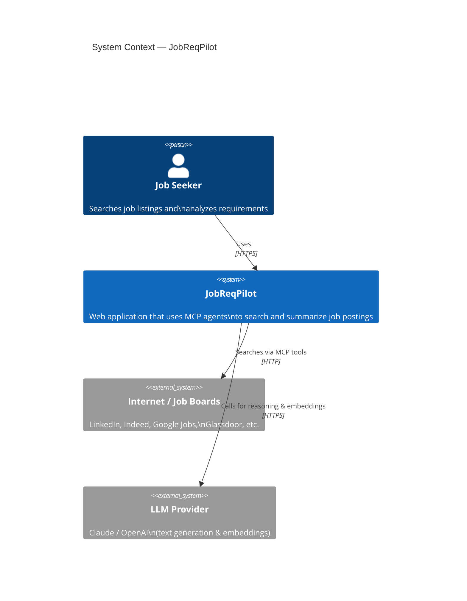
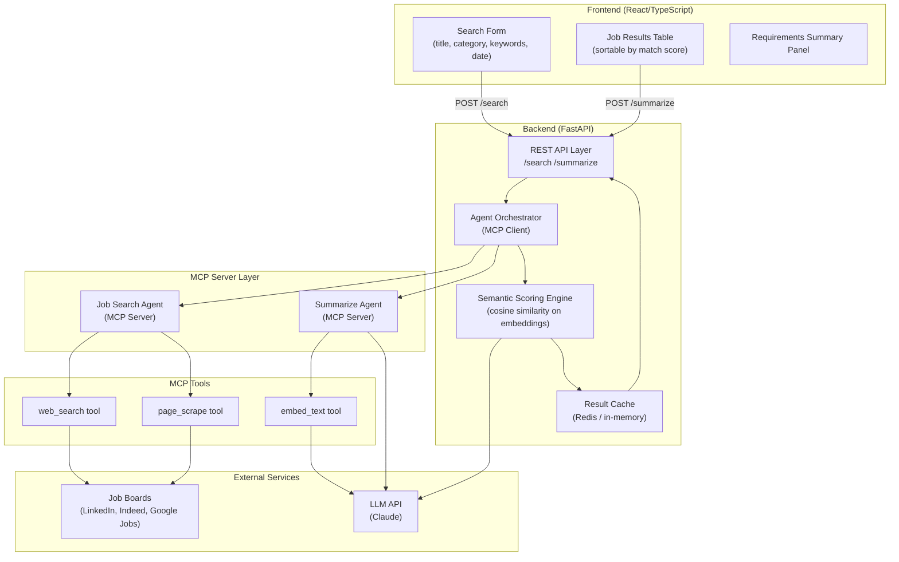
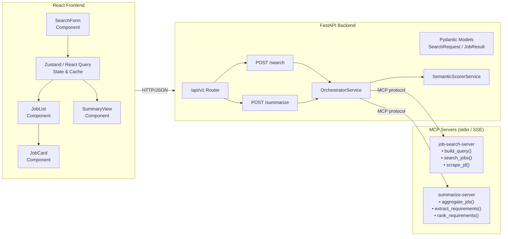
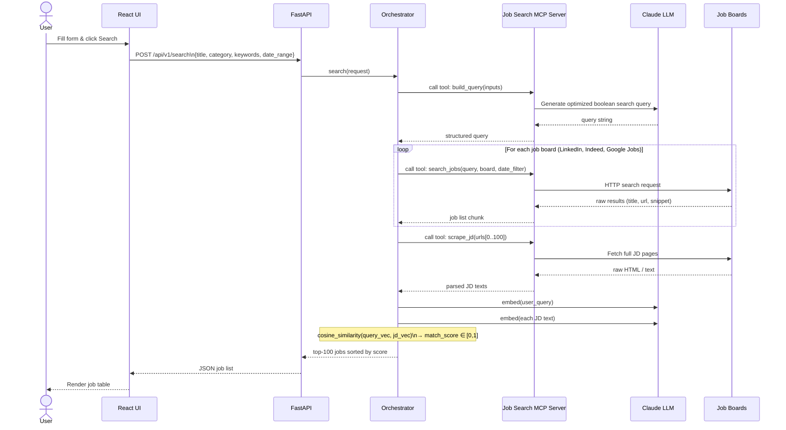
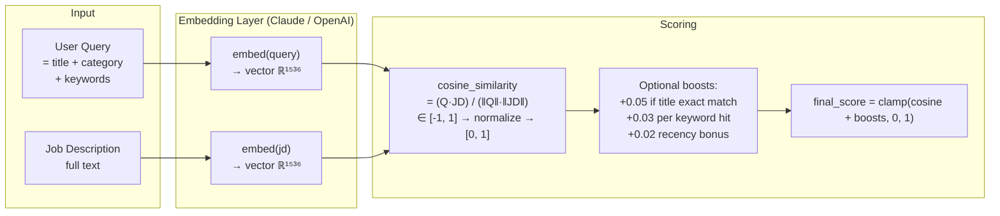

# JobReqPilot — Architecture Design

## Table of Contents
1. [System Overview](#1-system-overview)
2. [High-Level Architecture](#2-high-level-architecture)
3. [Component Architecture](#3-component-architecture)
4. [Search Flow](#4-search-flow)
5. [Summarize Flow](#5-summarize-flow)
6. [Semantic Scoring Design](#6-semantic-scoring-design)
7. [Project Directory Structure](#7-project-directory-structure)
8. [Key Technology Decisions](#8-key-technology-decisions)

---

## 1. System Overview



---

## 2. High-Level Architecture



---

## 3. Component Architecture



---

## 4. Search Flow



---

## 5. Summarize Flow


---

## 6. Semantic Scoring Design

Match scores use **embedding-based cosine similarity**, the industry-standard approach used by LinkedIn, Indeed, and modern ATS systems.



### Scoring Formula

```
base_score  = cosine_similarity(embed(query), embed(jd))   # ∈ [0, 1]
title_boost = 0.05 if job_title contains query_title (case-insensitive)
kw_boost    = 0.03 × min(matched_keywords / total_keywords, 1.0)
date_boost  = 0.02 if posted within date_range else 0

final_score = clamp(base_score + title_boost + kw_boost + date_boost, 0.0, 1.0)
```

---

## 7. Project Directory Structure

```
JobReqPilot/
├── frontend/                        # React + TypeScript (Vite)
│   ├── src/
│   │   ├── components/
│   │   │   ├── SearchForm.tsx       # Title, category, keywords, date inputs
│   │   │   ├── JobList.tsx          # Sortable results table
│   │   │   ├── JobCard.tsx          # Individual job result row
│   │   │   └── SummaryView.tsx      # Requirements summary panel
│   │   ├── api/                     # Axios/fetch wrappers
│   │   │   ├── search.ts
│   │   │   └── summarize.ts
│   │   ├── store/                   # Zustand global state
│   │   │   └── jobStore.ts
│   │   └── types/                   # Shared TypeScript types
│   │       └── index.ts
│   ├── index.html
│   ├── vite.config.ts
│   └── package.json
│
├── backend/                         # FastAPI
│   ├── app/
│   │   ├── api/
│   │   │   └── v1/
│   │   │       ├── search.py        # POST /api/v1/search
│   │   │       └── summarize.py     # POST /api/v1/summarize
│   │   ├── models/                  # Pydantic schemas
│   │   │   ├── search.py            # SearchRequest, JobResult
│   │   │   └── summarize.py         # SummarizeRequest, RequirementsSummary
│   │   ├── services/
│   │   │   ├── orchestrator.py      # MCP client, agent coordination
│   │   │   └── scorer.py            # Embedding + cosine similarity
│   │   └── main.py                  # FastAPI app entry point
│   ├── pyproject.toml
│   └── .env.example
│
├── mcp-servers/
│   ├── job-search/                  # MCP Server 1 — Job Search
│   │   ├── server.py                # MCP server entry point
│   │   └── tools/
│   │       ├── build_query.py       # LLM-powered boolean query builder
│   │       ├── search_jobs.py       # Multi-board job search
│   │       └── scrape_jd.py         # JD page scraper & parser
│   └── summarize/                   # MCP Server 2 — Summarization
│       ├── server.py
│       └── tools/
│           ├── aggregate_jds.py     # Chunk & deduplicate JD content
│           └── extract_requirements.py  # LLM-powered requirement extraction
│
├── docker-compose.yml
└── ARCHITECTURE.md
```

---

## 8. Key Technology Decisions

| Concern | Choice | Rationale |
|---|---|---|
| **MCP transport** | stdio (dev) / SSE (prod) | stdio is simple locally; SSE allows horizontal scaling |
| **LLM** | Claude claude-sonnet-4-6 | Best tool-use & long-context support (needed for 100 JDs) |
| **Embeddings** | `text-embedding-3-large` (OpenAI) or Claude embeddings | 1536-dim vectors; best-in-class semantic retrieval accuracy |
| **Scoring** | Cosine similarity on dense embeddings + lightweight heuristic boosts | Industry standard; interpretable; fast at inference time |
| **Frontend state** | React Query (server state) + Zustand (UI state) | React Query handles caching & background refetch; Zustand is minimal |
| **Job board access** | SerpAPI / Bright Data or direct scraping via MCP tool | SerpAPI gives structured results with legal compliance |
| **Backend cache** | Redis (prod) / in-memory dict (dev) | Avoids re-embedding identical queries; TTL-based invalidation |
| **API style** | REST with SSE streaming for long-running searches | Simple to consume from React; streaming gives progressive UX |
