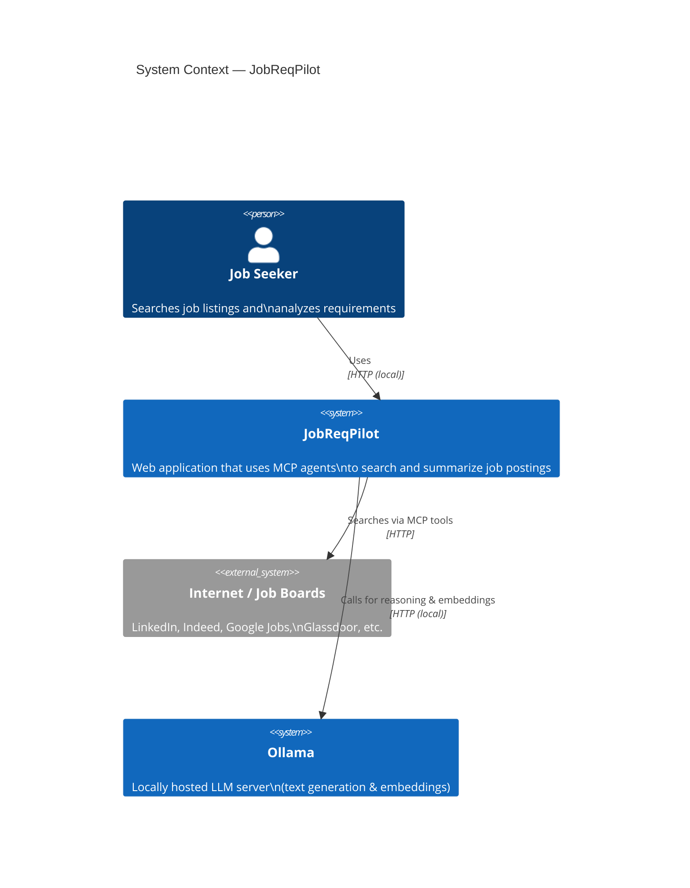
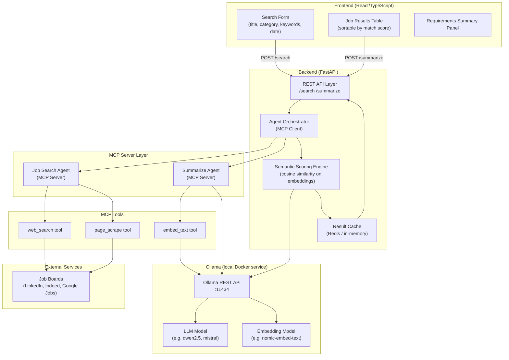
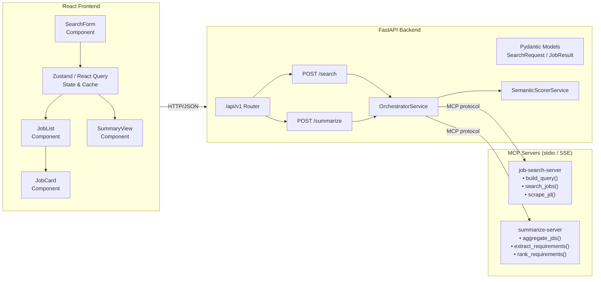
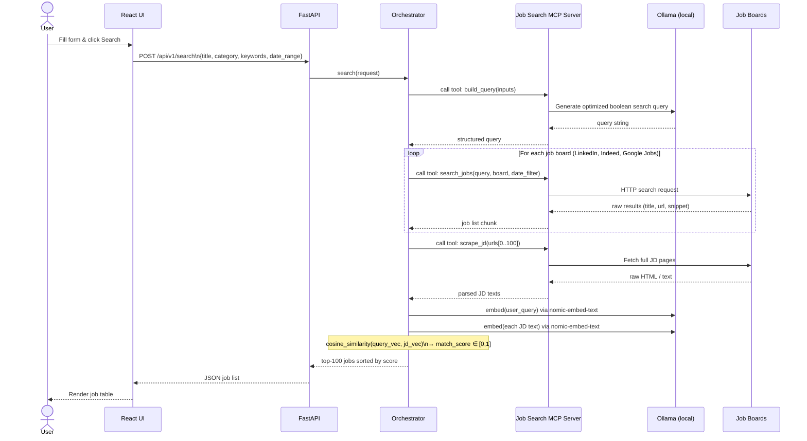
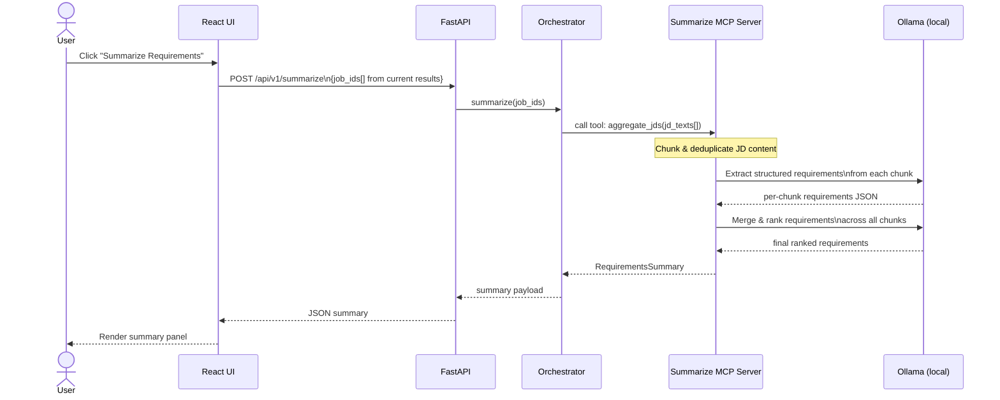
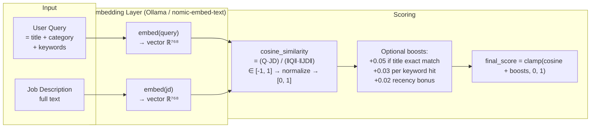
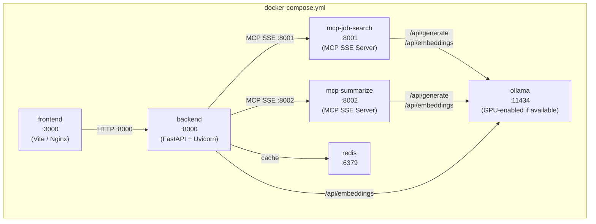

# JobReqPilot — Architecture Design

## Table of Contents
1. [System Overview](#1-system-overview)
2. [High-Level Architecture](#2-high-level-architecture)
3. [Component Architecture](#3-component-architecture)
4. [Search Flow](#4-search-flow)
5. [Summarize Flow](#5-summarize-flow)
6. [Semantic Scoring Design](#6-semantic-scoring-design)
7. [Project Directory Structure](#7-project-directory-structure)
8. [Docker Compose Deployment](#8-docker-compose-deployment)
9. [Key Technology Decisions](#9-key-technology-decisions)

---

## 1. System Overview



---

## 2. High-Level Architecture



---

## 3. Component Architecture



---

## 4. Search Flow



---

## 5. Summarize Flow



---

## 6. Semantic Scoring Design

Match scores use **embedding-based cosine similarity**, the industry-standard approach used by LinkedIn, Indeed, and modern ATS systems.



### Scoring Formula

```
# embed() calls Ollama's nomic-embed-text model at http://ollama:11434/api/embeddings
base_score  = cosine_similarity(embed(query), embed(jd))   # ∈ [0, 1]
title_boost = 0.05 if job_title contains query_title (case-insensitive)
kw_boost    = 0.03 × min(matched_keywords / total_keywords, 1.0)
date_boost  = 0.02 if posted within date_range else 0

final_score = clamp(base_score + title_boost + kw_boost + date_boost, 0.0, 1.0)
```

---

## 7. Project Directory Structure

```
JobReqPilot/
├── frontend/                        # React + TypeScript (Vite)
│   ├── src/
│   │   ├── components/
│   │   │   ├── SearchForm.tsx       # Title, category, keywords, date inputs
│   │   │   ├── JobList.tsx          # Sortable results table
│   │   │   ├── JobCard.tsx          # Individual job result row
│   │   │   └── SummaryView.tsx      # Requirements summary panel
│   │   ├── api/                     # Axios/fetch wrappers
│   │   │   ├── search.ts
│   │   │   └── summarize.ts
│   │   ├── store/                   # Zustand global state
│   │   │   └── jobStore.ts
│   │   └── types/                   # Shared TypeScript types
│   │       └── index.ts
│   ├── index.html
│   ├── vite.config.ts
│   ├── Dockerfile
│   └── package.json
│
├── backend/                         # FastAPI
│   ├── app/
│   │   ├── api/
│   │   │   └── v1/
│   │   │       ├── search.py        # POST /api/v1/search
│   │   │       └── summarize.py     # POST /api/v1/summarize
│   │   ├── models/                  # Pydantic schemas
│   │   │   ├── search.py            # SearchRequest, JobResult
│   │   │   └── summarize.py         # SummarizeRequest, RequirementsSummary
│   │   ├── services/
│   │   │   ├── orchestrator.py      # MCP client, agent coordination
│   │   │   └── scorer.py            # Embedding + cosine similarity
│   │   └── main.py                  # FastAPI app entry point
│   ├── pyproject.toml
│   ├── Dockerfile
│   └── .env.example                 # OLLAMA_BASE_URL, SERPAPI_KEY, etc.
│
├── mcp-servers/
│   ├── job-search/                  # MCP Server 1 — Job Search
│   │   ├── server.py                # MCP server entry point
│   │   ├── Dockerfile
│   │   └── tools/
│   │       ├── build_query.py       # LLM-powered boolean query builder
│   │       ├── search_jobs.py       # Multi-board job search
│   │       └── scrape_jd.py         # JD page scraper & parser
│   └── summarize/                   # MCP Server 2 — Summarization
│       ├── server.py
│       ├── Dockerfile
│       └── tools/
│           ├── aggregate_jds.py     # Chunk & deduplicate JD content
│           └── extract_requirements.py  # LLM-powered requirement extraction
│
├── docker-compose.yml               # Orchestrates all services + Ollama
├── docker-compose.override.yml      # Dev overrides (hot-reload, port bindings)
├── .env.example                     # Top-level env template
└── docs/
    └── ARCHITECTURE.md
```

---

## 8. Docker Compose Deployment

All services run as containers in a shared Docker Compose network (`jobreqpilot_net`). Ollama is included as a service so no external API keys or cloud LLM access are required.



### Service Summary

| Service | Image | Ports | Purpose |
|---|---|---|---|
| `frontend` | `jobreqpilot/frontend` | `3000` | React UI (Nginx in prod, Vite HMR in dev) |
| `backend` | `jobreqpilot/backend` | `8000` | FastAPI REST API + orchestrator |
| `mcp-job-search` | `jobreqpilot/mcp-job-search` | `8001` | Job Search MCP Server (SSE transport) |
| `mcp-summarize` | `jobreqpilot/mcp-summarize` | `8002` | Summarize MCP Server (SSE transport) |
| `redis` | `redis:7-alpine` | `6379` | Result & embedding cache |
| `ollama` | `ollama/ollama` | `11434` | Local LLM inference server |

### Environment Variables (`.env`)

```dotenv
# Ollama
OLLAMA_BASE_URL=http://ollama:11434
OLLAMA_LLM_MODEL=qwen2.5:14b          # or mistral, llama3.2, etc.
OLLAMA_EMBED_MODEL=nomic-embed-text

# External
SERPAPI_KEY=<your-key>

# Redis
REDIS_URL=redis://redis:6379/0
```

### Ollama Model Pull (first run)

```bash
# Pull required models on first start (runs inside the ollama container)
docker compose run --rm ollama ollama pull qwen2.5:14b
docker compose run --rm ollama ollama pull nomic-embed-text
```

### Dev vs Prod

- **Dev** (`docker compose up`): uses `docker-compose.override.yml` — mounts source dirs as volumes for hot-reload, exposes all ports on localhost.
- **Prod** (`docker compose -f docker-compose.yml up`): no volume mounts, Nginx serves the built React bundle, only port `3000` exposed externally.

---

## 9. Key Technology Decisions

| Concern | Choice | Rationale |
|---|---|---|
| **MCP transport** | SSE (Docker service-to-service) | Services communicate over the internal Docker network; SSE is stateless and horizontally scalable |
| **LLM** | Ollama — `qwen2.5:14b` (default) | Runs fully locally via Docker; no API key required; swappable via `OLLAMA_LLM_MODEL` env var |
| **Embeddings** | Ollama — `nomic-embed-text` (768-dim) | State-of-the-art open-source embedding model; runs locally via the same Ollama container |
| **Scoring** | Cosine similarity on dense embeddings + lightweight heuristic boosts | Industry standard; interpretable; fast at inference time |
| **Frontend state** | React Query (server state) + Zustand (UI state) | React Query handles caching & background refetch; Zustand is minimal |
| **Job board access** | SerpAPI / Bright Data or direct scraping via MCP tool | SerpAPI gives structured results with legal compliance |
| **Backend cache** | Redis (Docker service) | Avoids re-embedding identical queries; TTL-based invalidation; same service in dev and prod |
| **API style** | REST with SSE streaming for long-running searches | Simple to consume from React; streaming gives progressive UX |
| **Deployment** | Docker Compose | Single `docker compose up` starts the full stack including Ollama; no cloud dependencies |
